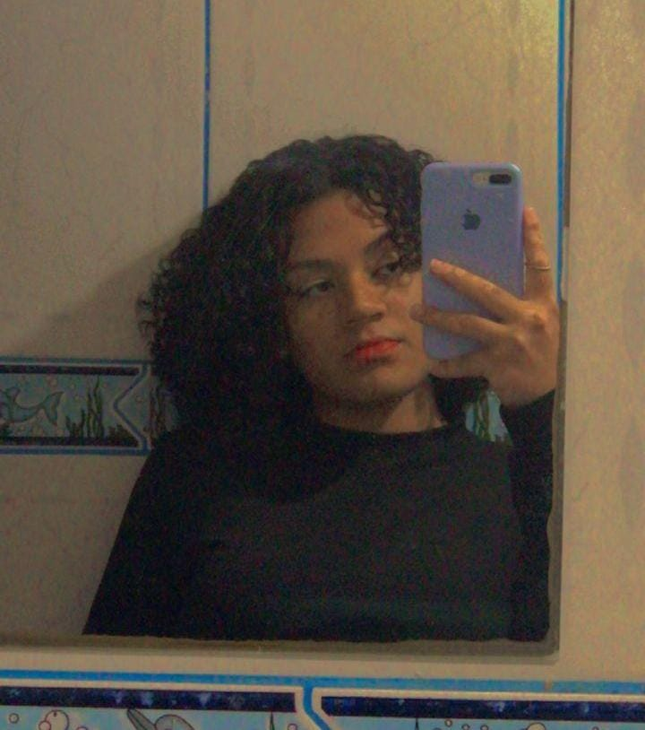

<h1 align="center">
🎬 Projeto GenFlix - Bloco I | Generation Brasil
</h1>

## 👩🏻‍💻 Projeto

Repositório com o código do <strong>projeto Genflix</strong>, projeto de finalização do bloco I do bootcamp Java FullStack, da <a href="https://www.linkedin.com/school/generationbrasil">Generation Brasil</a>. 
A ideia do projeto é organizar os filmes dos usuários em duas listas, "Assistidos" e "Não assistidos", facilitando o controle e tornando o gerenciamento dos filmes mais simples e facilitado.
 Neste projeto foram trabalhados:

- Entrada e saída de dados;
- Laços condicionais;
- Laços de repetição;
- Métodos e modificadores de acesso;
- Classes, atributos e objetos;
- Conceitos de POO, como polimorfismo, herança e sobrecarga;
- Classes abstratas e interfaces;
- Collections;
- Exceptions.

## 📚 Seções
O projeto é composto por 2 seções diferentes:

- **Menu Principal:** Nele temos as funcionalidades para manipular o array de contas;
- **Menu do Usuário:** Nessa seção, temos todas as funcionalidades de manipulação do array de filmes do usuário;

#### 🎬 Confira <a href="https://www.canva.com/design/DAFbDX4tYWA/1WVLXPTtizdF3fxnMp257w/view#1"> aqui </a>a apresentação de slides do projeto:
  
 ## 💫 Tecnologias e Ferramentas

Este projeto foi desenvolvido com as seguintes tecnologias e ferramentas:

- Java
- Eclipse / SpringToolSuite

## 🤝 Participantes

<h4>
    Elizangela Xavier
</h4>
     
    <a href="https://github.com/ElizangelaXavierS">GitHub</a> 
<a href="https://www.linkedin.com/in/elizangelaxavier/">Linkedin</a>

<h4>
Fernando Alves de Paula
</h4>
 
<a href="https://github.com/fewatts">GitHub</a> 
<a href="https://www.linkedin.com/in/fernando-alves-85091716b/">Linkedin</a>

<h4>
    Giovana Maiara
</h4>
     
    <a href="https://github.com/macgii">GitHub</a> 
<a href="https://www.linkedin.com/in/giovana-maiara-concei%C3%A7%C3%A3o-de-oliveira-5a7124264/">Linkedin</a>

<h4>
    Isaac M. Castanho
</h4>
     
    <a href="https://github.com/Isaac-MCastanho">GitHub</a> 
<a href="https://www.linkedin.com/in/isaacmcastanho/">Linkedin</a>

<h4>
Katiana Xavier
</h4>
     
    <a href="https://github.com/KatianaXavier">GitHub</a> 
<a href="https://www.linkedin.com/in/katianaxavier/">Linkedin</a>
    

<h4>
    Luan Silva
</h4>
     
    <a href="https://github.com/LuanSilva94">GitHub</a> 
<a href="https://www.linkedin.com/in/luan-silva-6506a61a1/">Linkedin</a>

